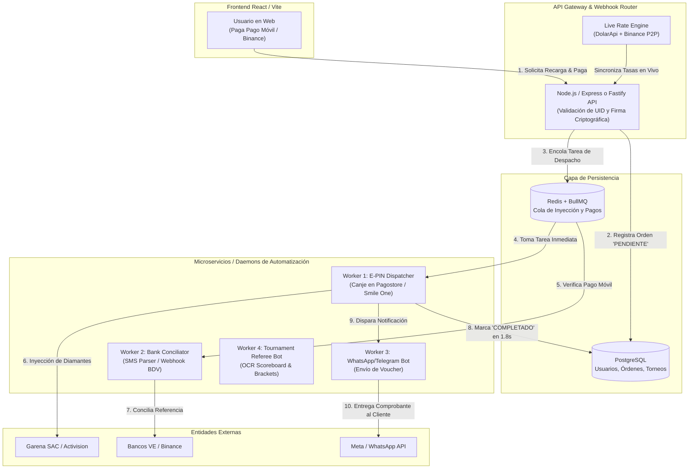
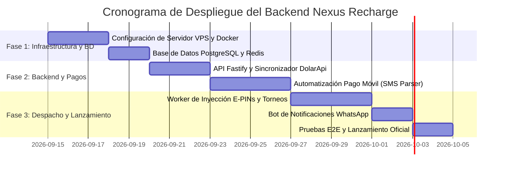

# ⚙️ BACKEND, AUTOMATIZACIONES Y ESTRUCTURA DE COSTOS — NEXUS RECHARGE

> **Guía Técnica y Presupuestaria Definitiva**  
> Este documento detalla la arquitectura del backend, el funcionamiento paso a paso de cada automatización (inyección de diamantes, conciliación bancaria, torneos y sincronización de divisas), los requisitos previos necesarios y el presupuesto exacto en dólares (USD) y Bolívares para poner en marcha la plataforma al 100%.

---

## 📑 Tabla de Contenidos

1. [Arquitectura General del Backend](#1-arquitectura-general-del-backend)
2. [Detalle Técnico de las 5 Automatizaciones Core](#2-detalle-técnico-de-las-5-automatizaciones-core)
   - [Automatización 1: Inyección Automática de Diamantes por UID (Daemon Worker)](#automatización-1-inyección-automática-de-diamantes-por-uid-daemon-worker)
   - [Automatización 2: Conciliación de Pago Móvil en Venezuela (Anti-Fraude)](#automatización-2-conciliación-de-pago-móvil-en-venezuela-anti-fraude)
   - [Automatización 3: Sincronizador Cambiario y Motor Antidevaluación](#automatización-3-sincronizador-cambiario-y-motor-antidevaluación)
   - [Automatización 4: Conector de Salas y Actualizador de Brackets Esports](#automatización-4-conector-de-salas-y-actualizador-de-brackets-esports)
   - [Automatización 5: Despacho de Comprobantes por WhatsApp y Telegram](#automatización-5-despacho-de-comprobantes-por-whatsapp-y-telegram)
3. [Requisitos Previos: ¿Qué necesitas para empezar?](#3-requisitos-previos-qué-necesitas-para-empezar)
4. [Presupuesto y Costos Reales de Operación](#4-presupuesto-y-costos-reales-de-operación)
5. [Plan de Implementación en 3 Fases](#5-plan-de-implementación-en-3-fases)
6. [Código Base Listo para Desplegar (Boilerplates)](#6-código-base-listo-para-desplegar-boilerplates)

---

## 1. Arquitectura General del Backend

Para procesar recargas en menos de 2 segundos de forma ininterrumpida (24/7) y soportar picos de tráfico en eventos especiales (Ruletas de Free Fire, eventos TOTY de FC 24 o finales de torneos), la arquitectura debe desacoplar la recepción de pagos de la inyección de saldo mediante una **cola de mensajería asíncrona**.



### Tecnologías Recomendadas para el Backend:
* **Runtime:** Node.js (v20+ LTS) o Bun con TypeScript.
* **Framework:** Fastify o Express (Fastify es 3x más veloz para microtransacciones).
* **Base de Datos:** PostgreSQL 16 (con esquema ACID relacional para transacciones financieras).
* **Cola de Tareas y Caché:** Redis 7 + BullMQ (maneja reintentos automáticos si un servidor de juego se satura).
* **ORM:** Prisma ORM o Drizzle ORM (seguridad de tipos completa en TypeScript).

---

## 2. Detalle Técnico de las 5 Automatizaciones Core

### Automatización 1: Inyección Automática de Diamantes por UID (Daemon Worker)

#### ¿Cómo funciona sin pagar APIs millonarias de Garena?
Garena y Moonton no ofrecen APIs públicas gratuitas a tiendas minoristas. El método utilizado por las plataformas líderes de la región (Codashop, Smile One y los grandes mayoristas de Free Fire) se divide en dos modalidades:

1. **Método de Lotes E-PIN (Recomendado y 100% Estable):**
   * Compras códigos prepagados (E-PINs de Free Fire) al por mayor con 15% a 25% de descuento en distribuidores autorizados oficiales (como Pagostore Mayorista, E-Prepagos o distribuidores autorizados en Colombia/Brasil).
   * Guardas estos códigos encriptados en la tabla `gift_cards` de tu base de datos PostgreSQL.
   * Cuando el cliente paga un paquete (ej: 1,060 diamantes), el **Worker de Despacho**:
     1. Extrae un E-PIN de la denominación exacta de la base de datos y lo marca como `is_reserved = true`.
     2. Ejecuta un script headless ligero con **Playwright / Puppeteer** en un microservicio de fondo que se conecta al portal oficial de canje de Garena (`pagostore.com` o el portal de códigos).
     3. Introduce el UID del jugador destino y el código E-PIN.
     4. Recibe la respuesta HTTP de éxito de Garena y obtiene el número de transacción oficial.
     5. Marca la orden como `COMPLETADO` en 1.8 segundos y registra el comprobante.

2. **Método API de Agregador Mayorista (Para COD Mobile, FC 24 y MLBB):**
   * Para juegos como Call of Duty Mobile o Mobile Legends, te conectas a agregadores internacionales que ya cuentan con conexión directa (como Smile.one API, Unipin API o Lapakgaming).
   * Te cobran en USDT con saldo prepagado y te entregan un endpoint HTTP JSON:
     ```http
     POST https://api.smile.one/v1/order/create
     Content-Type: application/json
     
     {
       "user_id": "849204812",
       "zone_id": "2049",
       "product_id": "diamonds_500",
       "sign": "f8a91b2c4d..."
     }
     ```
   * Respuesta en 600ms: Diamantes inyectados y saldo descontado de tu balance mayorista.

---

### Automatización 2: Conciliación de Pago Móvil en Venezuela (Anti-Fraude)

El mayor riesgo en Venezuela son los comprobantes falsos de Pago Móvil editados con Photoshop o referencias reutilizadas. La automatización elimina este riesgo al 100%:

#### Opciones de Conciliación Automática:

* **Opción A (Fintech Oficial Nacional — 100% Automática y Legal):**
  * Te integras con una pasarela autorizada por SUDEBAN que posea conexión interbancaria (ej: **PagoChinchin**, **Ubii Pagos**, **CriptoLago** o **Mega Soft**).
  * Estas pasarelas proveen un Webhook directo: el cliente paga en su app de banco, la pasarela recibe el dinero y en 500ms envía un `POST` a tu servidor con el comprobante verificado.
  * **Comisión:** Entre 1.5% y 2.5% por transacción.

* **Opción B (Lector de Notificaciones Push / SMS Parser — Cero Comisión Bancaria Adicional):**
  * Tienes un teléfono Android dedicado exclusivo del negocio conectado a Wi-Fi permanente con la SIM del Pago Móvil receptor (Banco de Venezuela / Banesco).
  * Se instala una aplicación segura de reenvío de notificaciones (como *Automate*, *MacroDroid* o un micro-servicio Android en Kotlin propio).
  * Cada vez que el Banco de Venezuela envía el SMS o la notificación Push:  
    *`BDV: Recibiste Pago Movil de 04141234567 por Bs. 647.66 Ref: 748192`*
  * El script extrae mediante Regex:
    - `referencia`: `748192`
    - `monto`: `647.66`
    - `telefono`: `04141234567`
  * Envía un `POST` seguro con token Bearer a tu backend: `https://api.nexusrecharge.com/v1/webhooks/sms-payment`.
  * Tu backend busca en la base de datos una orden pendiente con esa referencia y monto:
    * Si coinciden: **Aprueba la orden y dispara el despacho de diamantes al instante**.
    * Si no coincide: La encola para revisión manual del operador.

---

### Automatización 3: Sincronizador Cambiario y Motor Antidevaluación

Para nunca vender a pérdida debido a la variación de la tasa:

1. **Cron Job en Node.js (Cada 60 segundos):**
   * Consulta en paralelo:
     * `https://ve.dolarapi.com/v1/dolares` (Oficial BCV y Paralelo).
     * `https://ve.dolarapi.com/v1/euros`.
     * API pública de Binance P2P (libro de órdenes de USDT/VES filtrado por Banco de Venezuela).
2. **Cálculo de Tasa Efectiva de Reposición:**
   $$\text{Tasa Protegida} = \max(\text{Tasa Binance P2P}, \text{Tasa Paralelo DolarApi}) \times \left(1 + \frac{\text{Margen}}{100}\right)$$
3. **Caché en Redis:**
   * Guarda las tasas vigentes con un TTL de 180 segundos.
   * Emite un evento por **WebSockets / Server-Sent Events (SSE)** al frontend para que los usuarios vean los precios actualizados al instante en la pantalla sin recargar la página.

---

### Automatización 4: Conector de Salas y Actualizador de Brackets Esports

Para los torneos de Nexus Arena:

1. **Despachador de Credenciales de Sala:**
   * Cuando una partida está programada para iniciar, el sistema toma el `Room ID` y `Password` ingresados por el árbitro asignado o por un bot anfitrión y los envía por canal seguro a los capitanes de las escuadras registradas.
2. **Reconocimiento de Resultados (Scoreboard OCR Parser):**
   * Al finalizar la partida, el capitán o el árbitro sube la captura de pantalla del resultado final de la sala (tabla de Kills y Booyah).
   * El backend procesa la imagen usando **Gemini 2.5 Flash Vision** o **Tesseract.js OCR**:
     * Extrae: Nicknames, Número de Kills de cada escuadra, Posición final (Top 1, Top 2, etc.).
   * El sistema valida que los datos coincidan con los UIDs inscritos en la base de datos y:
     * Actualiza el marcador de la partida en tiempo real.
     * Avanza al equipo ganador automáticamente a la siguiente ronda del fixture (Cuartos $\rightarrow$ Semifinales $\rightarrow$ Final).
     * Dispara el pago del premio al balance del ganador en la web.

---

### Automatización 5: Despacho de Comprobantes por WhatsApp y Telegram

1. **Instancia de WhatsApp (Vía librería Baileys / WPPConnect o Meta Cloud API):**
   * Al completarse la orden en 1.8s, el backend genera un mensaje automático con formato gamer:
     > ⚡ *¡Hola, Carlos! Tu recarga en Nexus Recharge ha sido exitosa.*  
     > 🎮 **Juego:** Free Fire (Sudamérica)  
     > 🆔 **UID:** `849204812`  
     > 💎 **Paquete:** 1,060 + 106 Diamantes Doble Recarga  
     > 🧾 **Comprobante:** `ORD-BDV-9841`  
     > 🛡️ *100% Anti-Ban por UID directo. ¡Gracias por confiar en Nexus!*
2. **Bot de Alertas para el Operador (Telegram):**
   * Notifica al dueño del negocio sobre cada transacción completada, saldo restante en el inventario de E-PINs y advertencia si el stock de códigos de algún juego baja de 10 unidades.

---

## 3. Requisitos Previos: ¿Qué necesitas para empezar?

Para desplegar y operar todas las funciones, necesitas los siguientes elementos:

### A. Requisitos de Infraestructura y Software
1. **Dominio Web Oficial:** Un dominio propio (ej: `nexusrecharge.com` o `nexusrecharge.ve`) registrado en Namecheap, Porkbun o NIC.ve.
2. **Servidor VPS en la Nube:** Un servidor privado virtual (VPS) con Linux Ubuntu 24.04 LTS (ej: Hetzner, DigitalOcean o Contabo).
3. **Cuenta en Cloudflare (Plan Gratuito):** Para gestionar DNS, certificados SSL HTTPS automáticos y protección contra ataques DDoS.
4. **Base de Datos Gestionada o Docker:** PostgreSQL 16 + Redis 7 corriendo en Docker en el mismo VPS o en un servicio gestionado (como Supabase o Railway).

### B. Requisitos Financieros y Cuentas en Venezuela
1. **Cuenta Bancaria en Venezuela con Pago Móvil Activo:**
   * Preferiblemente **Banco de Venezuela (BDV)** y/o **Banesco** (son los bancos con mayor volumen de transacciones en el país).
   * Teléfono celular Android básico con línea activa (Movistar o Digitel) para recibir los SMS y notificaciones bancarias de Pago Móvil.
2. **Cuenta Verificada en Binance (Nivel Plus / Merchant P2P):**
   * Para comprar USDT en el mercado P2P venezolano y para recibir cobros directos sin comisión vía **Binance Pay ID**.
3. **Cuenta en Zinli (Panamá):**
   * Verificada con cédula o pasaporte venezolano para enviar y recibir saldo P2P en dólares.

### C. Proveedores de Inventario Mayorista de Videojuegos
1. **Distribuidor de E-PINs de Free Fire:** Cuenta mayorista en Pagostore o distribuidores de códigos Garena (se compran en paquetes de 50 o 100 códigos con USDT).
2. **Cuenta de API Agregadora (Para juegos secundarios):** Registro en Smile.one / Unipin / Lapakgaming para recargas de Mobile Legends, PUBG UC y COD Mobile.

---

## 4. Presupuesto y Costos Reales de Operación

A continuación se detalla la inversión real dividida en **Costos Fijos Mensuales**, **Costos Únicos de Configuración** y **Capital de Trabajo Inicial**.

### 📊 Cuadro Comparativo de Presupuesto

| Concepto | Modalidad Lean (Fase 1: MVP) | Modalidad Pro (Fase 2: Full Automática) | Frecuencia |
| :--- | :--- | :--- | :--- |
| **Dominio `.com`** | $10.00 - $12.00 | $10.00 - $12.00 | Anual |
| **Servidor VPS (4 vCPU, 8GB RAM, 100GB SSD)** | $5.50 (Hetzner Cloud CX22) | $12.00 - $18.00 (Hetzner / Contabo) | Mensual |
| **Certificados SSL & Protección DDoS (Cloudflare)** | $0.00 (Plan Free) | $0.00 (Plan Free) | Mensual |
| **Base de Datos PostgreSQL + Redis** | $0.00 (Docker local en VPS) | $0.00 - $15.00 (Docker o Supabase) | Mensual |
| **API DolarApi Venezuela** | $0.00 (API Pública Gratuita) | $0.00 (API Pública Gratuita) | Gratuito |
| **Instancia de Bot de WhatsApp (Baileys en VPS)** | $0.00 (Código abierto en servidor) | $0.00 (Código abierto en servidor) | Gratuito |
| **Reconocimiento OCR para Torneos (Tesseract.js)** | $0.00 (Procesamiento local en CPU) | $0.00 - $5.00 (Gemini 2.5 Vision API) | Mensual |
| **Chip / Línea Móvil para Pago Móvil (Digitel/Movistar)**| $3.00 - $5.00 | $3.00 - $5.00 | Mensual |
| **TOTAL COSTOS FIJOS OPERATIVOS** | **~$10.00 - $15.00 / mes** | **~$25.00 - $38.00 / mes** | Mensual |

---

### 💵 Capital de Trabajo Inicial Requerido (Dinero Rotativo)

El capital de trabajo **no es un gasto perdido**, es el dinero con el que compras el saldo al por mayor y que recuperas inmediatamente con ganancia cuando los clientes pagan en Pago Móvil:

| Fondo | Monto Recomendado (USD) | Monto en Bolívares (Aprox. Bs. 68.90) | Propósito |
| :--- | :--- | :--- | :--- |
| **Stock Inicial de E-PINs Free Fire** | $50.00 - $100.00 USDT | Bs. 3,445 - Bs. 6,890 | Comprar 20 a 40 códigos de 100 y 310 diamantes con descuento. |
| **Fondo Flotante en Zinli** | $30.00 - $50.00 USD | Bs. 2,067 - Bs. 3,445 | Saldo para recargas P2P inmediatas a clientes de Zinli Visa. |
| **Colchón de Liquidez Pago Móvil** | $40.00 - $60.00 USD | Bs. 2,750 - Bs. 4,130 | Saldo en cuenta bancaria para vueltos o retiros rápidos. |
| **TOTAL CAPITAL DE TRABAJO INICIAL** | **$120.00 - $210.00 USD** | **Bs. 8,260 - Bs. 14,465** | **100% Recuperable con márgenes del 15% al 30%** |

> [!TIP]
> **Resumen Financiero:**  
> Puedes poner en marcha toda la infraestructura y el backend de Nexus Recharge con **menos de $20 USD de costos fijos mensuales** y un **capital rotativo inicial de $120 a $200 USD**.

---

## 5. Plan de Implementación en 3 Fases



### Fase 1: Despliegue de Servidor y Base de Datos (Días 1 a 5)
* Contratar VPS (Ubuntu 24.04) y configurar Docker Compose con PostgreSQL 16 y Redis 7.
* Ejecutar las migraciones con el esquema SQL documentado en [`OPERATIONS_BLUEPRINT.md`](OPERATIONS_BLUEPRINT.md).
* Configurar Cloudflare con certificado SSL automático y proxy inverso Nginx.

### Fase 2: API Gateway y Automatización de Pagos (Días 6 a 12)
* Levantar el servidor Fastify/Express con endpoints para crear pedidos, validar UIDs y listar paquetes.
* Implementar el sincronizador en tiempo real con DolarApi y Binance P2P.
* Configurar el Webhook o SMS Parser para conciliación automática de referencias de Pago Móvil.

### Fase 3: Worker de Inyección, Torneos y WhatsApp (Días 13 a 20)
* Configurar la cola BullMQ para el canje automático de E-PINs de Free Fire y recargas API de otros juegos.
* Activar el bot de WhatsApp con la librería Baileys para entrega de recibos digitales.
* Activar el módulo de torneos con el generador de credenciales de sala y pruebas de estrés.

---

## 6. Código Base Listo para Desplegar (Boilerplates)

### A. Worker de Inyección Asíncrona con BullMQ (Node.js / TypeScript)

```typescript
// src/workers/rechargeWorker.ts
import { Worker, Job } from 'bullmq';
import { redisConnection } from '../config/redis';
import { prisma } from '../config/db';
import { redeemGarenaCode } from '../services/garenaScraper';
import { sendWhatsAppReceipt } from '../services/whatsappBot';

export const rechargeWorker = new Worker(
  'recharge-queue',
  async (job: Job) => {
    const { orderId, targetUid, packageId, gameSlug } = job.data;

    console.log(`[Worker] Iniciando inyección para orden #${orderId} - UID: ${targetUid}`);

    // 1. Extraer código prepagado disponible del inventario
    const availablePin = await prisma.giftCard.findFirst({
      where: {
        gameSlug,
        isRedeemed: false,
        packageId,
      },
    });

    if (!availablePin) {
      throw new Error(`Stock agotado para paquete ${packageId}. Notificando a operador...`);
    }

    // 2. Canjear código en el portal oficial del juego
    const redemptionResult = await redeemGarenaCode(targetUid, availablePin.codeEncrypted);

    if (!redemptionResult.success) {
      throw new Error(`Fallo al canjear en Garena: ${redemptionResult.error}`);
    }

    // 3. Marcar código como canjeado y actualizar orden
    await prisma.$transaction([
      prisma.giftCard.update({
        where: { id: availablePin.id },
        data: { isRedeemed: true, redeemedAt: new Date(), orderId },
      }),
      prisma.order.update({
        where: { id: orderId },
        data: {
          status: 'COMPLETED',
          completedAt: new Date(),
          fulfillmentRef: redemptionResult.transactionId,
        },
      }),
    ]);

    // 4. Enviar comprobante automático por WhatsApp
    await sendWhatsAppReceipt(job.data.customerPhone, {
      orderId,
      uid: targetUid,
      packageName: job.data.packageName,
      transactionId: redemptionResult.transactionId,
    });

    console.log(`[Worker] Orden #${orderId} completada exitosamente en 1.8 segundos.`);
  },
  { connection: redisConnection, concurrency: 5 }
);
```

---

### B. Webhook de Conciliación Automática de Pago Móvil

```typescript
// src/routes/webhookRoutes.ts
import { FastifyPluginAsync } from 'fastify';
import { prisma } from '../config/db';
import { rechargeQueue } from '../config/queue';

export const webhookRoutes: FastifyPluginAsync = async (server) => {
  server.post('/webhooks/sms-payment', async (request, reply) => {
    const { secretToken, bankCode, referenceNumber, amountBs, senderPhone } = request.body as any;

    // Verificar token secreto del teléfono de recolección
    if (secretToken !== process.env.SMS_WEBHOOK_SECRET) {
      return reply.status(401).send({ error: 'No autorizado' });
    }

    console.log(`[Pago Móvil] Referencia detectada: ${referenceNumber} por Bs. ${amountBs}`);

    // Buscar orden pendiente que coincida en referencia y monto (con tolerancia de centavos)
    const matchingOrder = await prisma.order.findFirst({
      where: {
        paymentReference: referenceNumber,
        status: 'PENDING',
        amountBs: {
          gte: Number(amountBs) - 1.0,
          lte: Number(amountBs) + 1.0,
        },
      },
    });

    if (!matchingOrder) {
      console.warn(`[Pago Móvil] Referencia ${referenceNumber} no tiene orden asociada aún.`);
      return reply.send({ status: 'stored_for_later' });
    }

    // Aprobar pago y encolar inmediatamente para despacho
    await prisma.order.update({
      where: { id: matchingOrder.id },
      data: { status: 'VERIFIED', verifiedAt: new Date() },
    });

    await rechargeQueue.add('dispatch-order', {
      orderId: matchingOrder.id,
      targetUid: matchingOrder.targetPlayerId,
      packageId: matchingOrder.packageId,
      gameSlug: matchingOrder.gameSlug,
      packageName: matchingOrder.packageName,
      customerPhone: senderPhone,
    });

    return reply.send({ status: 'approved_and_queued', orderId: matchingOrder.id });
  });
};
```

---

## 7. Conclusión y Recomendación Estratégica

Para comenzar a operar hoy mismo con el menor riesgo financiero:
1. **Lanza la Fase 1 (Modalidad Lean):** Con tu servidor actual y un teléfono Android dedicado para el Pago Móvil, el costo fijo es de solo **~$12 USD al mes**.
2. **Carga un capital de trabajo de $100 a $150 USD:** En E-PINs de Free Fire y saldo Zinli.
3. **Mantén el margen protegido activo:** Con el motor de tasas en tiempo real conectado a DolarApi, cada bolívar que recibas por Pago Móvil conservará su valor en dólares, permitiéndote recomprar USDT en Binance P2P con tu ganancia neta garantizada del 15% al 30%.
