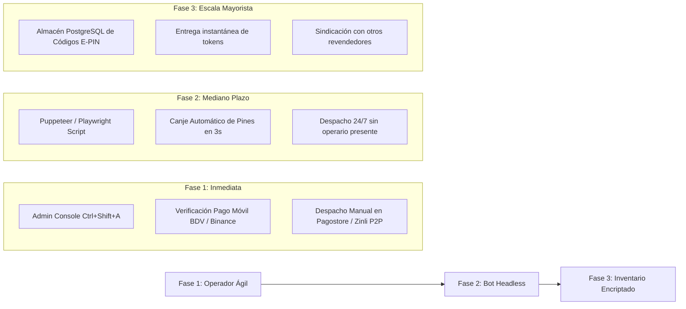

# 💼 BLUEPRINT OPERATIVO, FINANCIERO Y DE NEGOCIO (SIN APIS COSTOSAS)

> **Manual Estratégico de Rentabilidad y Despacho para Nexus Recharge en Venezuela.**  
> Este documento responde exactamente cómo operar de forma altamente rentable sin requerir APIs empresariales de miles de dólares, sin depender de intermediarios minoristas que destruyan el margen, y con la estructura óptima de comisiones para videojuegos, billeteras digitales (Zinli, Binance, Shein) y torneos esports.

---

## 💎 1. Diagnóstico de Viabilidad: ¿Es Realmente Rentable?

### **Respuesta Contundente: SÍ, ES EXTREMADAMENTE RENTABLE.**
En Venezuela convergen tres realidades socioeconómicas únicas:
1. **Población Gamer y Juvenil Masiva:** Millones de jugadores activos en Free Fire, COD Mobile, PUBG Mobile, Roblox y Mobile Legends.
2. **Brecha de Métodos de Pago Internacionales:** Más del 85% de la población no posee tarjeta de crédito internacional (Visa/Mastercard) en dólares para pagar directamente en Google Play, Apple App Store o las webs de los desarrolladores. La mayoría solo dispone de **Pago Móvil en Bolívares (BDV, Banesco, Mercantil)** o saldo USDT en Binance.
3. **Flujo de Caja Inmediato y Cero Deuda:** El cliente paga el 100% por adelantado antes del despacho. No hay cuentas por cobrar ni riesgo de morosidad.

---

## 🚫 2. Por qué NO Funciona Comprar en Páginas Minoristas de Reventa

Si compras saldo en páginas como Codashop comercial, Eneba al por menor u otras tiendas locales de Venezuela:
- Ellos ya te cobran entre un 10% y un 20% de recargo sobre el costo oficial.
- Al tú intentar revenderlo en Bolívares, tendrías que cobrar un 35% a 40% sobre el precio oficial, quedando fuera del mercado competitivo o trabajando con ganancias de céntimos que no cubren ni el riesgo de la devaluación cambiaria.
- **La Solución:** Trabajar con **Mayoristas Primarios de E-PINs**, **Cuentas de Distribuidor Regional**, y **Transferencias P2P Directas (para Zinli/Binance)**.

---

## 🛠️ 3. El Método Real de Despacho (Paso a Paso Sin API Millonaria)

A continuación se detalla cómo despachar cada servicio obteniendo el máximo margen de ganancia:

### A. Free Fire (El Rey del Volumen en Venezuela)
- **Portal de Entrega:** [Pagostore](https://pagostore.com/) (Portal oficial de Garena).
- **Mecanismo:** Pagostore permite recargar diamantes directamente introduciendo el **ID numérico del jugador** y canjeando un **PIN de Garena (E-PIN / Tarjeta de Diamantes)**.
- **¿Dónde se consiguen los E-PINs al por mayor con descuento?**
  - Distribuidores mayoristas autorizados de códigos digitales B2B globales (ej. cuentas comerciales en SeaGM Wholesale, OffGamers B2B, o distribuidores mayoristas de pines Garena en el sudeste asiático y Latinoamérica).
  - En compras por lotes (packs de 100, 310, 520, 1060 diamantes), el descuento mayorista oscila entre el **12% y el 18%** sobre el valor facial.
  - **Tiempo de Despacho:** 15 a 30 segundos de forma manual copiando el UID y pegando el PIN, o automatizable en Fase 2 con un bot ligero en Node.js/Python (Puppeteer / Playwright) que navega en segundo plano e introduce el PIN en 3 segundos sin pagar API oficial.

### B. PUBG Mobile & Mobile Legends (MLBB)
- **PUBG Mobile:** Portal oficial [Midasbuy](https://www.midasbuy.com/). Se ingresa el Player ID y se paga mediante **Razer Gold** (con cuentas mayoristas con bonus de descuento) o pines de Unknown Cash (UC).
- **Mobile Legends:** Portal [Smile.one](https://www.smile.one/) o Jollymax. Solo se requiere depositar un saldo inicial pequeño ($20 a $50 vía Binance Pay o tarjeta) en una cuenta mayorista/agente, lo cual otorga precios con descuento de revendedor oficial sin exigir fianzas bancarias millonarias.

### C. Billeteras Digitales y Plataformas: Zinli ("sinly"), Binance Pay y Shein
Esta fue tu solicitud explícita: **¿Cómo recargar Zinli y plataformas sin API?**

1. **Zinli (Tarjeta Virtual Visa en Panamá, usada masivamente en Venezuela):**
   - **Mecanismo:** **Transferencia P2P Instantánea dentro de Zinli.**
   - En Zinli, dos usuarios pueden enviarse dólares de forma instantánea usando únicamente el **correo electrónico o número telefónico** del destinatario, con **0% de comisión de red**.
   - **Flujo Operativo:**
     1. El cliente entra a Nexus Recharge, selecciona *"Zinli Recarga $10"*, coloca su correo registrado en Zinli y paga con Pago Móvil al cambio acordado.
     2. El operador abre la aplicación Zinli corporativa/personal y transfiere $10.00 al correo del cliente.
     3. La transacción se confirma en menos de 60 segundos.
   - **¿De dónde obtienes el saldo de Zinli?**
     - Puedes fondear tu saldo de Zinli comprando en **Binance P2P** (intercambias USDT por saldo Zinli a tasa casi 1:1 o incluso con 1-2% a favor) o mediante Pago Móvil propio de tus ventas.

2. **Binance Saldo Digital / USDT:**
   - Envío directo mediante **Binance Pay ID** o correo. Es 100% gratuito entre usuarios de Binance y se despacha en segundos.

3. **Shein / Compras Internacionales:**
   - Se ofrece como servicio de **Tarjeta de Regalo Shein** (Gift Card digital de $10, $25, $50) adquirida con descuento mayorista, o como servicio de **pago de carrito** (el operador paga la cesta con su tarjeta Zinli cobrando una comisión de servicio).

---

## 📊 4. Estructura Exacta de Porcentajes y Márgenes de Ganancia

Para ser competitivo en Venezuela y maximizar tu rentabilidad neta, debes aplicar una **estrategia de margen por niveles (Tiered Margin)**:

| Tipo de Producto | Rango de Precio (USD) | Margen Bruto Recomendado | Ejemplo de Costo Mayorista | Precio de Venta al Público | Ganancia Neta por Transacción |
| :--- | :--- | :--- | :--- | :--- | :--- |
| **Micro-Recargas Gaming** (100 Diamantes FF, 60 PUBG UC, 80 COD CP) | $0.90 – $2.50 | **22% – 30%** | $0.78 | $1.00 (en Bs. Pago Móvil) | **$0.22 (28% ROI)** |
| **Packs Medios / Pases** (Pase Booyah, 520 Diamantes, Pase COD) | $3.00 – $10.00 | **14% – 18%** | $3.35 | $3.95 (en Bs. Pago Móvil) | **$0.60 (18% ROI)** |
| **Packs Grandes VIP** (2,180 a 5,600 Diamantes) | $15.00 – $48.00 | **8% – 12%** | $43.00 | $48.00 (en Bs. o USDT) | **$5.00 (11.6% ROI)** |
| **Billetera Zinli** ($5, $10, $20, $50) | $5.00 – $50.00 | **6% – 10%** | $10.00 (costo saldo) | $10.80 a $11.00 (en Bs) | **$0.80 a $1.00 por transferencia** |
| **Gift Cards (Roblox, PlayStation, Steam)** | $10.00 – $50.00 | **8% – 12%** | $8.90 (código $10) | $10.00 | **$1.10 por código** |

### 💡 El Secreto del "Spread Cambiario" (Ganancia Oculta en Bolívares)
- Si la tasa de referencia oficial es, por ejemplo, **Bs. 62.50**, para protegerte de la variación diaria y costos bancarios, la tasa de venta de Nexus Recharge debe ser fijada con un margen del **2% al 4% sobre la tasa base** (ej. Bs. 64.50 por dólar), o sincronizada con el promedio del mercado informal/Binance P2P.
- Tan pronto recibes los Bolívares en tu Pago Móvil (BDV o Banesco), conviertes automáticamente el excedente de Bolívares a **USDT en Binance P2P**. Esto congela tu ganancia en dólares y te protege 100% de la inflación.

---

## 🏆 5. Rentabilidad del Apartado de Torneos (Nexus Arena)

Los torneos no son solo un espectáculo; son una **máquina de monetización y captación de clientes recurrentes**.

### Fórmula de Ingresos por Torneo:
1. **Comisión por Retención del Pozo (Platform Take Rate):**
   - Torneo Free Fire Cup de 32 Escuadras:
   - Inscripción: **$5.00 por escuadra** (pagados en Pago Móvil Bs. o Binance).
   - Recaudación Total: `32 equipos * $5.00 = $160.00 USD`.
   - Distribución de Premios:
     - 🥇 1er Lugar: $90.00 USD
     - 🥈 2do Lugar: $40.00 USD
     - 🥉 3er Lugar: $20.00 USD
     - **Pozo Total Repartido:** $150.00 USD.
   - **Retención Neta de Plataforma:** $10.00 a $25.00 USD de pura ganancia por 2 horas de partidas en sala privada.

2. **Efecto Embudo (Cross-Selling de Diamantes):**
   - De los 160 jugadores que compiten en el torneo, al menos un 30% a 40% necesita recargar diamantes para comprar cajas de armas con atributos, pases de batalla o skins exclusivas antes del evento. Todos ellos recargan directamente en tu plataforma.

3. **Costo de Operación del Torneo:**
   - Tarjetas de Sala Privada en Free Fire: cuestan solo 100 diamantes (menos de $0.80 USD).
   - El margen neto del torneo supera el **85%**.

---

## 🚀 6. Fases de Crecimiento Tecnológico (Escalabilidad Progresiva)

### Protocolo de Prevención de Fraudes con Pago Móvil:
1. **Anti-Captura Falsa:** Los clientes fraudulentos a menudo editan capturas de pantalla de Pago Móvil con Photoshop o Canva.
2. **Regla de Oro Nexus:** **NUNCA** se aprueba una recarga basándose únicamente en la foto del comprobante. El operador (o webhook bancario) valida el número de referencia directamente en la banca en línea de BDV/Banesco o mediante los mensajes SMS bancarios automáticos antes de inyectar los diamantes o transferir el saldo Zinli.
