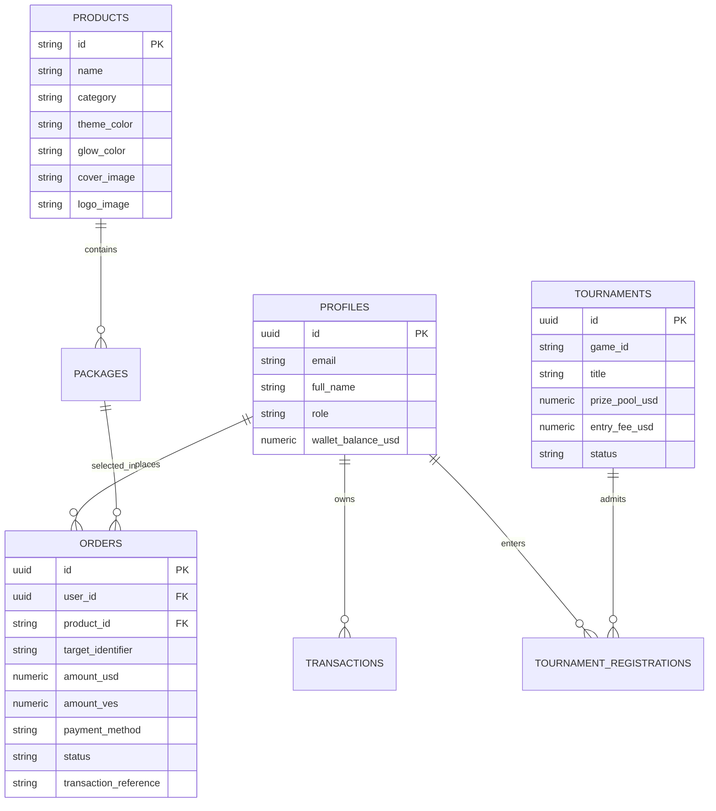

# ⚡ NEXUS RECHARGE — WORKSPACE MASTER INDEX & ARCHITECTURE CONTEXT

> **Plataforma Core de Recargas Gamer, Billeteras Digitales y Torneos Esports para Venezuela y Latinoamérica.**  
> Este documento es la **fuente única de verdad (Single Source of Truth)** del proyecto. Indexa toda la arquitectura técnica, diseño visual reactivo, catálogo de marcas oficiales 2026, flujos de recarga por plataforma, base de datos Supabase y protocolos operativos.

---

## 📑 Tabla de Contenidos

1. [Resumen Ejecutivo y Propuesta de Valor](#1-resumen-ejecutivo-y-propuesta-de-valor)
2. [Stack Tecnológico Oficial](#2-stack-tecnológico-oficial)
3. [Mapa Integral del Repositorio (File Index)](#3-mapa-integral-del-repositorio-file-index)
4. [Motor de Iluminación Ambiental Reactiva y Breathing Fluid Animation](#4-motor-de-iluminación-ambiental-reactiva-y-breathing-fluid-animation)
5. [Catálogo de Activos Oficiales y Matriz de Colores de Marca 2026](#5-catálogo-de-activos-oficiales-y-matriz-de-colores-de-marca-2026)
6. [Flujos de Recarga Personalizados por Plataforma (Step 1 Specs)](#6-flujos-de-recarga-personalizados-por-plataforma-step-1-specs)
7. [Nexus Arena Esports (Motor de Torneos FC 26, Free Fire y Brawl Stars)](#7-nexus-arena-esports-motor-de-torneos-fc-26-free-fire-y-brawl-stars)
8. [Arquitectura Backend Supabase y Esquema de Base de Datos](#8-arquitectura-backend-supabase-y-esquema-de-base-de-datos)
9. [Motor de Tasas en Vivo y Protección Cambiaria (DolarApi)](#9-motor-de-tasas-en-vivo-y-protección-cambiaria-dolarapi)
10. [Pipeline de Automatización y Scripts de Assets](#10-pipeline-de-automatización-y-scripts-de-assets)
11. [Consola Administrativa y Protocolo Operador (Ctrl+Shift+A)](#11-consola-administrativa-y-protocolo-operador-ctrlshifta)
12. [Guía de Ejecución, Compilación y Verificación de Tipos](#12-guía-de-ejecución-compilación-y-verificación-de-tipos)

---

## 1. Resumen Ejecutivo y Propuesta de Valor

- **Nombre:** Nexus Recharge (`nexus-recharge`)
- **Repositorio:** `https://github.com/kaddexomg/nexus.git` (Rama `main`)
- **Backend Activo:** Supabase Cloud (`https://qiykiwhipbcvnyfqoyuz.supabase.co`)
- **Misión:** Democratizar el acceso a bienes digitales para gamers y usuarios en Venezuela y Latinoamérica, permitiendo recargar videojuegos (Free Fire, EA Sports FC 26, PUBG Mobile, Brawl Stars, Valorant, Mobile Legends, Roblox, COD Mobile), billeteras virtuales (Zinli Tarjeta Visa USD) y suscripciones/gift cards (Spotify, Netflix, Steam, PlayStation, Xbox, Apple, Google Play, Discord Nitro, Shein).
- **Rieles de Pago Soportados:**
  - **Bolívares (VES):** Pago Móvil C2P/P2P instantáneo (Banco de Venezuela, Banesco, Mercantil, Provincial).
  - **Criptoactivos (USD):** Binance Pay (USDT) con acreditación instantánea mediante Pay ID y código QR.
  - **Saldo en Cuenta:** Wallet interna Nexus para usuarios registrados en Supabase.
- **Diferenciadores Clave:**
  - **0% Latencia Visual:** Iluminación ambiental reactiva acelerada por GPU que muta según el color oficial de cada marca al hacer hover o selección.
  - **Flujos de Recarga Especializados:** Cada plataforma solicita los datos técnicos exactos que exige su distribuidor (Zonas de servidor, regiones SAC/US/EU, plataformas de consola/móvil, o correos de E-PIN).
  - **Verificación Anti-Error (<0.01% fallos):** Pre-flight check antes de debitar fondos.
  - **Arena de Torneos Deportivos:** Reglas dinámicas adaptadas (FC 26 con formato de goles/penales, Free Fire Battle Royale con puntos por kill/top, Brawl Stars 3v3).

---

## 2. Stack Tecnológico Oficial

| Capa | Tecnología | Versión | Propósito |
| :--- | :--- | :--- | :--- |
| **Bundler & Dev Server** | [Vite](https://vitejs.dev/) | 6.2+ / 6.4.3 | Compilación ultrarrápida ESM, HMR instantáneo |
| **Runtime & Lenguaje** | [TypeScript](https://www.typescriptlang.org/) | 5.8+ | Tipado estricto (`tsc --noEmit`), cero errores `any` |
| **Framework UI** | [React](https://react.dev/) | 19.0+ | UI reactiva de alto rendimiento con Hooks modernos |
| **Estilos & Utility** | [Tailwind CSS](https://tailwindcss.com/) | v4.1 (@tailwindcss/vite) | Arquitectura CSS moderna, soporte de variables dinámicas |
| **Motor de Animación** | [Motion (Framer Motion)](https://motion.dev/) | v12.23+ | Orbes de respiración ambiental, parallax de scroll, modales |
| **Iconografía Base** | [Lucide React](https://lucide.dev/) | v0.546+ | Iconos vectoriales de interfaz |
| **Base de Datos & Auth** | [Supabase](https://supabase.com/) | JS v2.x | PostgreSQL 16, RLS, Auth con Email y Google OAuth |
| **Cotización en Vivo** | DolarApi VE | REST API | Sincronización continua de BCV, Paralelo USDT y Euro |
| **Motor de Audio** | Web Audio API | Nativo Navegador | Síntesis acústica procedural en tiempo real (sin MP3 externos) |

---

## 3. Mapa Integral del Repositorio (File Index)

```
nexus-recharge/
├── .env                              # Variables de entorno (Supabase URL, Anon Key, Service Key)
├── .env.example                      # Plantilla de variables para nuevos entornos
├── .gitignore                        # Exclusiones de Git (node_modules, dist, etc.)
├── AGENT_RULES.md                    # Reglas operativas estrictas para agentes de IA
├── BACKEND_AUTOMATIONS_AND_COSTS.md  # Blueprint financiero, presupuestos, APIs y daemon workers
├── OPERATIONS_BLUEPRINT.md           # Modelo comercial, márgenes y mitigación de devaluación
├── PROJECT_INDEX.md                  # Este documento: Índice maestro del sistema
├── README.md                         # Guía rápida para desarrolladores humanos
├── index.html                        # Entrada HTML con fuentes Google e Iconos
├── package.json                      # Scripts de NPM y dependencias oficiales
├── tsconfig.json                     # Configuración de compilación estricta de TypeScript
├── vite.config.ts                    # Configuración Vite con React y Tailwind v4
├── supabase_schema.sql               # Esquema SQL completo con RLS, triggers y tablas
│
├── public/
│   ├── assets/
│   │   ├── logos/                    # Logos oficiales 512x512 con estética iOS Squircle
│   │   │   ├── free-fire.png         # Garena Free Fire 2026 Squircle
│   │   │   ├── fc-26.png             # EA Sports FC 26 Mobile Squircle
│   │   │   ├── pubg-mobile.png       # PUBG Mobile Helmet Squircle
│   │   │   ├── brawl-stars.png       # Brawl Stars Skull Squircle
│   │   │   ├── spotify.png           # Spotify Original Green Squircle
│   │   │   ├── zinli.png             # Zinli Violet & Mint Squircle
│   │   │   ├── roblox.png            # Roblox Tilt Logo Squircle
│   │   │   ├── cod-mobile.png        # Call of Duty Mobile Skull Squircle
│   │   │   ├── mobile-legends.png    # Mobile Legends Bang Bang Squircle
│   │   │   ├── netflix.png           # Netflix Iconic 'N' Squircle
│   │   │   ├── discord-nitro.png     # Discord Clyde Squircle
│   │   │   ├── shein.png             # Shein Fashion Squircle
│   │   │   ├── steam.png             # Steam Valve Squircle
│   │   │   ├── playstation.png       # PlayStation Network Squircle
│   │   │   ├── xbox.png              # Xbox Sphere Squircle
│   │   │   ├── apple.png             # Apple App Store Squircle
│   │   │   ├── google-play.png       # Google Play Triangle Squircle
│   │   │   └── valorant.png          # Riot Valorant 'V' Squircle
│   │   ├── games/                    # Portadas oficiales Key-Art 2026 (800px optimizadas)
│   │   │   ├── free-fire.jpg         # Key Visual Oficial Garena Free Fire 2026
│   │   │   ├── fc-26.jpg             # Portada Oficial EA Sports FC 26
│   │   │   ├── pubg-mobile.jpg       # Key Art Erangel Nivel 3 Airdrop
│   │   │   ├── brawl-stars.jpg       # Key Art Starr Park Supercell
│   │   │   ├── zinli.jpg             # Composición Oficial Tarjeta Visa Zinli USD
│   │   │   ├── spotify.jpg           # Spotify UI & Artists Banner
│   │   │   ├── roblox.jpg            # Roblox Rivals 2026 Key Art
│   │   │   ├── cod-mobile.jpg        # Ghost / COD Mobile Official Art
│   │   │   ├── mobile-legends.jpg    # MLBB 5v5 Key Art
│   │   │   ├── netflix.jpg           # Netflix Originals Key Art
│   │   │   ├── discord-nitro.jpg     # Discord Nitro Neon Banner
│   │   │   ├── shein.jpg             # Shein Fashion Lifestyle Art
│   │   │   ├── steam.jpg             # Steam Deck & PC Gaming Art
│   │   │   ├── playstation.jpg       # PS5 DualSense & Horizon Key Art
│   │   │   ├── xbox.jpg              # Xbox Series X Game Pass Art
│   │   │   ├── apple.jpg             # Apple One / App Store Art
│   │   │   ├── google-play.jpg       # Google Play Games Key Art
│   │   │   └── valorant.jpg          # Valorant Agents Champions Key Art
│   │   └── banners/                  # Banners panorámicos para Hero y promociones
│   │       ├── banner-fc26.jpg       # Hero Banner FC 26 Mobile
│   │       ├── banner-freefire.jpg   # Hero Banner Garena Free Fire
│   │       ├── banner-valorant.jpg   # Hero Banner Valorant Champions
│   │       ├── banner-mlbb.jpg       # Hero Banner Mobile Legends
│   │       └── banner-wallets.jpg    # Hero Banner Billeteras & Zinli
│
└── src/
    ├── App.tsx                       # Orquestador SPA, Iluminación Dinámica reactiva, navegación
    ├── main.tsx                      # Punto de entrada React 19 con AuthProvider, Theme y Currency
    ├── index.css                     # Configuración de Tailwind v4, estilos globales y scrollbar
    ├── types.ts                      # Interfaces TypeScript (Game, Package, Order, Tournament)
    │
    ├── context/
    │   ├── AuthContext.tsx           # Contexto de autenticación Supabase (Login, Signup, Google OAuth)
    │   ├── CurrencyContext.tsx       # Monitor de divisas (BCV, USDT, EUR) y margen de ganancia
    │   └── ThemeContext.tsx          # Gestor de temas visuales (Dark, Light, Neón)
    │
    ├── services/
    │   ├── supabase.ts               # Cliente singleton Supabase inicializado con .env
    │   └── currencyService.ts        # Fetch a DolarApi con fallback de contingencia
    │
    ├── data/
    │   └── mockData.ts               # Catálogos oficiales, 18 productos, paquetes, torneos y logs
    │
    ├── utils/
    │   └── audio.ts                  # Sintetizador procedural Web Audio API (Click, Success, Error)
    │
    └── components/
        ├── Header.tsx                # Barra superior con navegación, saldo, switch de tema y botón Login
        ├── Hero.tsx                  # Carrusel de banners cinematográficos interactivos
        ├── ProductCatalog.tsx        # Catálogo unificado con tarjetas 16:10 recomendadas y grid de iOS squircles
        ├── ProductDetailPage.tsx     # Pantalla de checkout con lógica personalizada por plataforma (Step 1)
        ├── TournamentSection.tsx     # Tarjetas de torneos activos con reglas deportivas (FC 26, FF, Brawl)
        ├── InteractiveTournamentHub.tsx # Vista completa de torneos, llaves de eliminación y salas
        ├── ZinliWalletSection.tsx    # Sección especializada en tarjetas virtuales y recargas USD
        ├── ZinliWalletCard.tsx       # Tarjeta Visa Zinli interactiva con chip, contactless y balance
        ├── PaymentModal.tsx          # Modal de liquidación con datos Pago Móvil y Binance Pay QR
        ├── OrderTrackingModal.tsx    # Comprobante en vivo con barra de despacho en 1.8 segundos
        ├── OrderSearchSection.tsx    # Buscador de órdenes históricas por ID o referencia
        ├── LiveRateDashboard.tsx     # Monitor de tasas de cambio con simulador de márgenes
        ├── DynamicIsland.tsx         # Notificaciones flotantes de estado del sistema
        ├── AdminConsoleModal.tsx     # Consola secreta de operadores (Ctrl+Shift+A) con aprobación 1-click
        ├── ArchitectureGuideModal.tsx# Modal técnico con blueprint de arquitectura
        ├── AuthModal.tsx             # Modal de inicio de sesión con Email y Google OAuth
        ├── CommunityDiscord.tsx      # Widget de comunidad gamer con chat y actividad en vivo
        ├── DaemonTerminal.tsx        # Monitor en tiempo real de los logs del backend/inyección
        ├── MarqueeTicker.tsx         # Cinta transportadora de avisos y cotizaciones en vivo
        ├── RateCalculatorBanner.tsx  # Calculadora rápida de conversión Bs / USDT
        ├── RechargeTerminal.tsx      # Terminal alternativo de recarga guiada
        ├── SocialProofToast.tsx      # Toast flotante de compras recientes de otros usuarios
        ├── StepRechargeWizard.tsx    # Asistente por pasos complementario
        ├── TournamentArena.tsx       # Arena competitiva de enfrentamientos
        └── Footer.tsx                # Pie de página con enlaces legales, soporte WhatsApp y estado
```

---

## 4. Motor de Iluminación Ambiental Reactiva y Breathing Fluid Animation

El sistema visual en [src/App.tsx](file:///C:/Users/PC/Desktop/nexus-recharge/src/App.tsx) implementa un motor de atmósfera orgánica acelerada por hardware:

```mermaid
flowchart LR
    User([Usuario Interacciona]) -->|Hover en Tarjeta| Catalog[ProductCatalog / Hero]
    User -->|Selecciona Producto| Detail[ProductDetailPage]
    
    Catalog -->|setHoveredGame| State[State: activeGame]
    Detail -->|setSelectedGame| State
    
    State -->|Extrae themeColor & glowColor| Engine[Engine de Iluminación GPU]
    
    subgraph Engine [Ambient Breathing Light Engine]
        Orb1[Orbe Superior Primario\nSinusoidal 9s Loop]
        Orb2[Orbe Secundario\nSinusoidal 12s Loop]
        Orb3[Orbe Acento Lateral\nSinusoidal 10s Loop]
        Laser[Rayo Láser Neón Superior\nHalo de 350px]
        Parallax[Parallax Vinculado al Scroll\nuseTransform -0.2x a 0.25x]
    end
    
    Engine --> InjectVars[Inyección de CSS Variables:\n--brand-current & --brand-glow]
    InjectVars --> DOM[Reflejo Inmediato en Fondo, Bordes y Badges]
```



### Características Técnicas:
1. **Sinusoidal Breathing Loop:** 3 orbes con gradientes radiales infinitos que ejecutan transformaciones simultáneas en escala (`1.2` a `1.5`) y traslación bi-axial (`x: [0, 50, -40, 0]`, `y: [0, -60, 45, 0]`) con curvas `easeInOut` desfasadas (9s, 12s, 10s).
2. **Scroll Parallax Dinámico:** Utiliza `useScroll()` y `useTransform()` de Motion para desplazar las fuentes de luz a diferentes profundidades mientras el usuario navega verticalmente.
3. **Inyección en Tiempo Real de Variables CSS:**
   - `--brand-current`: Almacena el color hexadecimal oficial de la marca activa.
   - `--brand-glow`: Almacena el valor RGBA con transparencia difusa (`0.45` a `0.55`) para cajas de resplandor.
4. **Respuesta Cero Latencia (0ms):** Los eventos `onMouseEnter` y `onMouseLeave` actualizan inmediatamente la atmósfera sin recargas ni saltos de renderizado.

---

## 5. Catálogo de Activos Oficiales y Matriz de Colores de Marca 2026

Todos los iconos fueron procesados con curvatura de super-elipse de Apple (**iOS Squircle**, `rounded-[22%]`), borde especular de cristal blanco (`border border-white/15`) y sombra de profundidad (`shadow-xl shadow-black/60`).

| ID / Slug | Nombre Oficial | Color Hex | Glow Color (RGBA) | Logo Path (iOS Squircle) | Portada Path (2026 Key-Art) |
| :--- | :--- | :--- | :--- | :--- | :--- |
| `free-fire` | Garena Free Fire | `#ff5500` | `rgba(255, 85, 0, 0.45)` | `/assets/logos/free-fire.png` | `/assets/games/free-fire.jpg` |
| `fc-26` | EA Sports FC 26 Mobile | `#00ff87` | `rgba(0, 255, 135, 0.50)` | `/assets/logos/fc-26.png` | `/assets/games/fc-26.jpg` |
| `zinli` | Zinli Dólares Visa | `#672fbf` | `rgba(103, 47, 191, 0.55)` | `/assets/logos/zinli.png` | `/assets/games/zinli.jpg` |
| `pubg-mobile` | PUBG Mobile | `#f59e0b` | `rgba(245, 158, 11, 0.45)` | `/assets/logos/pubg-mobile.png` | `/assets/games/pubg-mobile.jpg` |
| `brawl-stars` | Brawl Stars | `#facc15` | `rgba(250, 204, 21, 0.45)` | `/assets/logos/brawl-stars.png` | `/assets/games/brawl-stars.jpg` |
| `spotify` | Spotify Premium | `#1ed760` | `rgba(30, 215, 96, 0.45)` | `/assets/logos/spotify.png` | `/assets/games/spotify.jpg` |
| `netflix` | Netflix Oficial | `#e50914` | `rgba(229, 9, 20, 0.45)` | `/assets/logos/netflix.png` | `/assets/games/netflix.jpg` |
| `roblox` | Roblox | `#e11d48` | `rgba(225, 29, 72, 0.45)` | `/assets/logos/roblox.png` | `/assets/games/roblox.jpg` |
| `valorant` | Valorant Points | `#ff4655` | `rgba(255, 70, 85, 0.45)` | `/assets/logos/valorant.png` | `/assets/games/valorant.jpg` |
| `mobile-legends` | Mobile Legends | `#38bdf8` | `rgba(56, 189, 248, 0.45)` | `/assets/logos/mobile-legends.png` | `/assets/games/mobile-legends.jpg` |
| `cod-mobile` | Call of Duty: Mobile | `#eab308` | `rgba(234, 179, 8, 0.45)` | `/assets/logos/cod-mobile.png` | `/assets/games/cod-mobile.jpg` |
| `steam` | Steam Wallet USD | `#1a9fff` | `rgba(26, 159, 255, 0.45)` | `/assets/logos/steam.png` | `/assets/games/steam.jpg` |
| `playstation` | PlayStation Network | `#0070d1` | `rgba(0, 112, 209, 0.45)` | `/assets/logos/playstation.png` | `/assets/games/playstation.jpg` |
| `xbox` | Xbox Game Pass | `#107c10` | `rgba(16, 124, 16, 0.45)` | `/assets/logos/xbox.png` | `/assets/games/xbox.jpg` |
| `google-play` | Google Play Store | `#01875f` | `rgba(1, 135, 95, 0.45)` | `/assets/logos/google-play.png` | `/assets/games/google-play.jpg` |
| `apple` | Apple Gift Card | `#0071e3` | `rgba(0, 113, 227, 0.45)` | `/assets/logos/apple.png` | `/assets/games/apple.jpg` |
| `discord-nitro` | Discord Nitro | `#5865f2` | `rgba(88, 101, 242, 0.45)` | `/assets/logos/discord-nitro.png` | `/assets/games/discord-nitro.jpg` |
| `shein` | Shein Moda | `#f43f5e` | `rgba(244, 63, 94, 0.45)` | `/assets/logos/shein.png` | `/assets/games/shein.jpg` |

> [!IMPORTANT]
> **Identidad Oficial de Zinli:**  
> Zinli utiliza como color primario el **Violeta Iris Real (`#672fbf`)** con acentos en **Menta Eléctrico (`#00c9b7`)**. En la interfaz de recarga, Zinli despliega una **Tarjeta Visa Internacional Virtual en Vivo** que muestra el saldo seleccionado y el correo de acreditación en tiempo real.

---

## 6. Flujos de Recarga Personalizados por Plataforma (Step 1 Specs)

En [src/components/ProductDetailPage.tsx](file:///C:/Users/PC/Desktop/nexus-recharge/src/components/ProductDetailPage.tsx), el **Paso 1** se transforma dinámicamente según la plataforma seleccionada:

### 1. Free Fire (`free-fire`)
- **Campo Principal:** ID numérico del jugador (8 a 12 dígitos).
- **Selector de Región:** Pills interactivas obligatorias:
  - `SAC (Sudamérica)`
  - `US (Norteamérica / EE.UU.)`
  - `EU (Europa)`
- **Validación Regex:** `^\d{8,12}$`

### 2. EA Sports FC 26 Mobile (`fc-26`)
- **Campo Principal:** UID del jugador o EA Gamertag.
- **Selector de Plataforma:**
  - `FC Mobile (iOS / Android)`
  - `PlayStation (PS5 / PS4)`
  - `Xbox (Series X/S)`
  - `PC (EA App / Steam)`
- **Validación Regex:** `^\d{8,12}$`

### 3. Mobile Legends (`mobile-legends`)
- **Campos Dobles:**
  - `User ID`: Identificador numérico del jugador (6 a 10 dígitos).
  - `Server Zone ID`: Código del servidor de 4 dígitos entre paréntesis (ej: `2041`).
- **Validación Regex:** `^\d{6,10}$`

### 4. Brawl Stars (`brawl-stars`)
- **Campo Principal:** Supercell Player Tag con `#` (ej: `#8Y9QL2VP`).
- **Validación Regex:** `^#?[0-9A-Za-z]{6,12}$`

### 5. Zinli Dólares Visa (`zinli`)
- **Componente Visual:** Renderizado de la Tarjeta Visa Virtual Internacional interactiva.
- **Campos Requeridos:**
  - `Correo Electrónico Zinli`: Correo vinculado a la app Zinli Panamá.
  - `Nombre y Apellido del Titular`: Para validación de transferencia P2P.
- **Validación Regex:** `^[^\s@]+@[^\s@]+\.[^\s@]+$`

### 6. Streaming y Tarjetas de Regalo (Spotify, Netflix, Steam, PlayStation, Xbox, Apple, Shein)
- **Modo:** Entrega de Código Digital / E-PIN Oficial.
- **Campo Requerido:** Correo electrónico o número de WhatsApp verificado para recepción inmediata del voucher con instrucciones de canje.
- **Validación Regex:** Formato estándar de email RFC 5322.

---

## 7. Nexus Arena Esports (Motor de Torneos FC 26, Free Fire y Brawl Stars)

La sección competitiva [src/components/TournamentSection.tsx](file:///C:/Users/PC/Desktop/nexus-recharge/src/components/TournamentSection.tsx) y [src/components/InteractiveTournamentHub.tsx](file:///C:/Users/PC/Desktop/nexus-recharge/src/components/InteractiveTournamentHub.tsx) implementa métricas de juego reales:

### Torneo EA Sports FC 26: "Copa de Campeones Ultimate Team 1v1"
- **Formato:** Eliminación directa 1v1 (32 Jugadores).
- **Métricas Oficiales:** 
  - Goles a favor en 90 minutos reglamentarios.
  - Tiempo extra y definición por tiros desde el punto penal en caso de empate.
  - **No utiliza kills**, sino marcador deportivo de fútbol.
- **Premio:** $120.00 USD en FC Points + Trofeo Digital.
- **Requisitos:** Plantilla con valoración mínima 88 OVR.

### Torneo Free Fire: "Torneo Relámpago Squads Booyah"
- **Formato:** Batalla Campal (12 Escuadras / 48 Jugadores).
- **Métricas:** Sistema de puntos oficial Garena (Puntos por Posición Final Top 1-12 + 1 punto por cada Kill confirmada).
- **Premio:** 5,600 💎 + $150.00 USD en efectivo por Pago Móvil.

### Torneo Brawl Stars: "Championship 3v3 Atrapagemas"
- **Formato:** Al mejor de 3 partidas (Bo3) en modo Atrapagemas (Gem Grab).
- **Premio:** 3x Brawl Pass Plus + $90.00 USD.

---

## 8. Arquitectura Backend Supabase y Esquema de Base de Datos

El backend está configurado sobre Supabase PostgreSQL en la nube:
- **URL:** `https://qiykiwhipbcvnyfqoyuz.supabase.co`
- **Esquema:** Definido en [supabase_schema.sql](file:///C:/Users/PC/Desktop/nexus-recharge/supabase_schema.sql)
- **Cliente:** [src/services/supabase.ts](file:///C:/Users/PC/Desktop/nexus-recharge/src/services/supabase.ts)

### Tablas Principales:



### Seguridad y Triggers:
1. **Row Level Security (RLS):** Los usuarios solo pueden ver y editar sus propias órdenes y perfiles.
2. **Trigger `handle_new_user()`:** Se dispara tras el registro en `auth.users` creando el registro correspondiente en `public.profiles` de forma atómica.
3. **Autenticación con Google:** Integrado en [src/components/AuthModal.tsx](file:///C:/Users/PC/Desktop/nexus-recharge/src/components/AuthModal.tsx) mediante `supabase.auth.signInWithOAuth({ provider: 'google' })`.

---

## 9. Motor de Tasas en Vivo y Protección Cambiaria (DolarApi)

El servicio [src/services/currencyService.ts](file:///C:/Users/PC/Desktop/nexus-recharge/src/services/currencyService.ts) y [src/context/CurrencyContext.tsx](file:///C:/Users/PC/Desktop/nexus-recharge/src/context/CurrencyContext.tsx) garantizan la rentabilidad del negocio en Venezuela:

- **Endpoint Primario:** `https://ve.dolarapi.com/v1/dolares`
- **Fuentes:**
  - `Paralelo / Binance USDT`: Tasa de reposición del inventario mayorista.
  - `Oficial BCV`: Referencia legal bancaria en Bolívares.
  - `Euro Oficial BCV`: Para liquidaciones bancarias europeas.
- **Fórmula de Protección Antidevaluación:**
  $$\text{Precio en VES} = \text{Precio USD} \times \text{Tasa USDT Binance P2P} \times (1 + \text{Margen})$$
  Esto asegura que la plataforma nunca sufra pérdidas por desfase entre la tasa oficial y la tasa real de reposición de los códigos o saldo mayorista.

---

## 10. Pipeline de Automatización y Scripts de Assets

Para garantizar la máxima fidelidad gráfica sin depender de imágenes de baja resolución o enlaces rotos, se crearon scripts de descarga y estandarización en `scratch/`:

1. **Consulta Oficial iTunes Lookup API (`scratch/fetch_itunes_apps.py`):**
   - Extrae iconos oficiales de 512x512 y 1024x1024 directo de los servidores de Apple sin requerir claves de API.
2. **Generador de iOS Squircles con Pillow (`scratch/process_official_assets.py`):**
   - Aplica una máscara matemática de super-elipse (`x^4 + y^4 = r^4` / radio `22%`), borde de cristal y sombra alfa transparente.
3. **Optimizador de Portadas 2026:**
   - Procesa Key-Art covers de 800px de ancho con compresión JPEG progresiva de 88% para tiempos de carga < 120ms.

---

## 11. Consola Administrativa y Protocolo Operador (Ctrl+Shift+A)

La plataforma incluye una consola de administración oculta para despachadores y operadores:

- **Atajo de Teclado:** Presionar `Ctrl + Shift + A` (o `Cmd + Shift + A` en macOS).
- **Acceso:** Protegido por rol (`admin` / `operator`) en el contexto de sesión.
- **Capacidades Operativas:**
  1. **Aprobación en 1 Clic:** Revisa capturas de Pago Móvil o referencias de Binance y transiciona la orden a `COMPLETADA`.
  2. **Kill-Switch General:** Desactiva temporalmente el botón de cobro en caso de mantenimiento de la banca venezolana (ej: caída nocturna de Suiche 7B).
  3. **Ajuste de Margen en Vivo:** Permite cambiar el margen de protección entre 5% y 35% al instante.

---

## 12. Guía de Ejecución, Compilación y Verificación de Tipos

### 1. Iniciar Servidor de Desarrollo Local
```bash
npm install
npm run dev
```
Disponible inmediatamente en `http://localhost:3000/`.

### 2. Comprobación Estricta de Tipos (TypeScript)
```bash
npx tsc --noEmit
```
Debe retornar **0 errores**. Es obligatorio ejecutarlo antes de cada commit.

### 3. Compilación para Producción (Vite Build)
```bash
npm run build
```
Genera los bundles optimizados en `dist/`.

### 4. Sincronización con GitHub
```bash
git status
git add .
git commit -m "feat/docs: descripcion del cambio"
git push origin main
```

---

<div align="center">
<strong>NEXUS RECHARGE © 2026</strong> — Infraestructura de Pagos y Entretenimiento Gamer de Alto Rendimiento.
</div>
