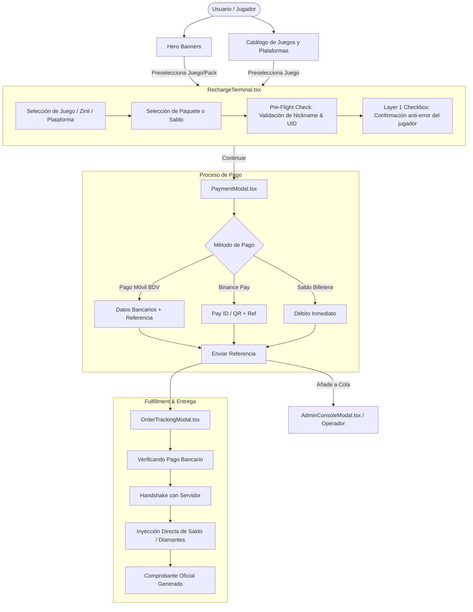

# ⚡ NEXUS RECHARGE — WORKSPACE INDEX & DEVELOPER ONBOARDING

> **Plataforma Core de Recargas Gamer, Billeteras Digitales y Torneos Esports para Venezuela.**  
> Este documento sirve como guía maestra de inducción para cualquier agente de IA o desarrollador humano que ingrese a trabajar en este repositorio.

---

## 🧭 1. Resumen Ejecutivo del Proyecto

- **Nombre:** Nexus Recharge (`nexus-recharge`)
- **Propósito:** Permitir a usuarios en Venezuela y Latinoamérica recargar videojuegos (Free Fire, COD Mobile, FC 24, PUBG, Roblox, Mobile Legends, Brawl Stars) y billeteras virtuales/plataformas digitales (Zinli, Binance, Steam, PlayStation, Shein) pagando en Bolívares (Pago Móvil BDV / Banesco) o criptomonedas (Binance Pay USDT) **sin requerir tarjetas de crédito internacionales ni APIs empresariales de miles de dólares**.
- **Propuesta de Valor:**
  1. **Pre-Flight Check Anti-Error:** Verificación obligatoria de Nickname/ID antes del cobro para evitar recargas a cuentas erróneas (tasa de error < 0.01%).
  2. **Conciliación en Bolívares y USDT:** Tasas sincronizadas en tiempo real con protección cambiaria.
  3. **Nexus Arena Esports:** Torneos comunitarios con inscripción en Pago Móvil/USDT, control de salas, llaves (brackets) y generación de comisiones.
  4. **Modos Visuales Dinámicos:** Soporte para Modo Oscuro (Dark Gamer), Modo Claro (Clean Pro) y Modo Neón (Cyberpunk Glow).

---

## 🛠️ 2. Stack Tecnológico

| Capa | Tecnología | Versión / Detalle |
| :--- | :--- | :--- |
| **Runtime & Bundler** | [Node.js](https://nodejs.org/) / [Vite](https://vitejs.dev/) | Vite 6.2+, ESM Modules |
| **Lenguaje** | [TypeScript](https://www.typescriptlang.org/) | TypeScript ~5.8 (Strict Typing) |
| **Framework UI** | [React](https://react.dev/) | React 19.0+ |
| **Estilos & UI** | [Tailwind CSS](https://tailwindcss.com/) | Tailwind v4.1 (@tailwindcss/vite) |
| **Iconografía** | [Lucide React](https://lucide.dev/) | Lucide v0.546+ |
| **Animaciones** | [Motion](https://motion.dev/) | Motion v12.23+ (Framer Motion) |
| **Audio Sintetizado** | Web Audio API nativo | Síntesis acústica procedural (sin archivos MP3 externos) |

---

## 📁 3. Mapa de la Estructura del Código

```
 nexus-recharge/
 ├── AGENT_RULES.md               # Reglas estrictas de desarrollo y construcción
 ├── OPERATIONS_BLUEPRINT.md      # Modelo de negocio, márgenes y método operativo sin APIs
 ├── PROJECT_INDEX.md             # Este archivo: Mapa integral del repositorio
 ├── README.md                    # Instrucciones de ejecución rápida local
 ├── index.html                   # HTML base, fuentes Geist y Google Fonts
 ├── metadata.json                # Metadatos del contenedor y capacidades
 ├── package.json                 # Dependencias y scripts de ejecución
 ├── tsconfig.json                # Configuración de compilador TypeScript
 ├── vite.config.ts               # Plugins de Vite (React + Tailwind v4)
 └── src/
     ├── App.tsx                  # Enrutador multi-pantalla SPA con transiciones Motion
     ├── main.tsx                 # Entrada React 19 con ThemeProvider y CurrencyProvider
     ├── index.css                # Estilos globales Tailwind v4 y modos de color
     ├── types.ts                 # Contratos TypeScript (Juegos, Órdenes, Torneos)
     ├── services/
     │   └── currencyService.ts   # Conexión en vivo con DolarApi (BCV, Paralelo USDT, Euro)
     ├── context/
     │   ├── ThemeContext.tsx     # Proveedor de temas: Dark, Light y Neón
     │   └── CurrencyContext.tsx  # Proveedor de divisas en vivo y motor de margen protegido
     ├── components/
     │   ├── Header.tsx           # Barra superior: navegación modular, saldo, switch de tema
     │   ├── DynamicIsland.tsx    # Notificaciones flotantes de estado del sistema
     │   ├── Hero.tsx             # Sección inicial con banners VIP dinámicos
     │   ├── StepRechargeWizard.tsx # Flujo guiado de recargas por etapas (Juego -> UID -> Combos -> Pago)
     │   ├── InteractiveTournamentHub.tsx # Hub de torneos: inscripción, salas de juego y fixtures
     │   ├── LiveRateDashboard.tsx# Monitor de divisas en tiempo real y simulador de margen
     │   ├── ZinliWalletSection.tsx # Billeteras internacionales: Tarjeta Visa Zinli, Steam, Shein
     │   ├── OrderSearchSection.tsx # Rastreador y buscador de órdenes por ID o referencia
     │   ├── GameCatalog.tsx      # Catálogo con portadas HD, publisher tags y badges oficiales
     │   ├── PaymentModal.tsx     # Modal de liquidación con datos de Pago Móvil / Binance
     │   ├── OrderTrackingModal.tsx # Voucher de acreditación y tracking en 1.8 segundos
     │   ├── AdminConsoleModal.tsx# Consola secreta interna de operadores (Ctrl+Shift+A)
     │   ├── ArchitectureGuideModal.tsx # Modal con diagrama SQL y arquitectura
     │   └── NexusBotWidget.tsx   # Asistente virtual flotante de soporte rápido
    │   ├── GameCatalog.tsx      # Catálogo visual de títulos y plataformas admitidas
    │   ├── NexusBotWidget.tsx   # Asistente virtual flotante interactivo
    │   ├── PaymentModal.tsx     # Modal de liquidación: datos bancarios Pago Móvil / Binance
    │   ├── OrderTrackingModal.tsx # Rastreador visual de despacho (1.8s) y comprobante oficial
    │   ├── AdminConsoleModal.tsx# Consola administrativa interna (Ctrl+Shift+A)
    │   ├── ArchitectureGuideModal.tsx # Esquema SQL, arquitectura y blueprint técnico
    │   ├── CommunityDiscord.tsx # Chat de comunidad y testimonios de jugadores
    │   ├── DaemonTerminal.tsx   # Monitor de logs del microservicio de inyección
    │   └── Footer.tsx           # Enlaces legales, soporte WhatsApp y estado de red
    ├── data/
    │   └── mockData.ts          # Catálogos de juegos, paquetes, tasas, torneos y logs
    └── utils/
        └── audio.ts             # Motor de sonido Web Audio API (clicks, éxito, alertas)
```

---

## 🔄 4. Flujo de Datos y Estados Globales (`App.tsx`)



---

## 🛡️ 5. Funciones y Módulos Clave

### A. Pre-Flight Check de Jugador (`RechargeTerminal.tsx`)
- **Propósito:** Prevenir errores humanos antes de transferir dinero.
- **Mecanismo:** Al teclear el ID/UID, el sistema valida la sintaxis y simula o consulta el Nickname real del jugador y su nivel.
- **Confirmación Obligatoria:** Un checkbox bloquea el botón de pago hasta que el usuario confirma explícitamente: *"Confirmo que este Nickname me pertenece"*.

### B. Módulo de Torneos (`TournamentArena.tsx`)
- Registro de equipos (Capitán + 3 titulares + 1 suplente con UIDs).
- Asignación de emblemas de clan.
- Visualización de llaves de eliminación (*Quarters, Semis, Final*).
- Acceso a credenciales de sala privada (*Room ID & Password*) tras confirmar check-in.

### C. Consola de Administración Operativa (`AdminConsoleModal.tsx`)
- **Acceso Secreto:** Presionar `Ctrl + Shift + A` (o `Cmd + Shift + A` en Mac).
- **Kill-Switch General:** Permite pausar ventas al instante en caso de mantenimiento bancario en Venezuela.
- **Aprobación de Órdenes:** El operador verifica la referencia bancaria y aprueba o rechaza el despacho con 1 clic.

### D. Motor de Audio Sintetizado (`src/utils/audio.ts`)
- No usa archivos `.mp3` ni `.wav` para evitar peticiones HTTP fallidas o latencia.
- Utiliza la Web Audio API con osciladores procedurales para producir:
  - `sound.playClick()` (Pulsación táctil)
  - `sound.playSuccess()` (Confirmación de compra o torneo)
  - `sound.playAlert()` (Validación fallida o advertencia)
  - `sound.playToggle()` (Cambio de tabs)

---

## 🚀 6. Protocolo de Inicio Rápido para Nuevos Agentes

1. **Leer Documentación:**
   - Lee `PROJECT_INDEX.md` (este archivo).
   - Lee `AGENT_RULES.md` para entender las reglas de código sin regresiones.
   - Lee `OPERATIONS_BLUEPRINT.md` para entender el modelo financiero y operativo de Venezuela.

2. **Instalar y Ejecutar:**
   ```bash
   npm install
   npm run dev
   ```
   La aplicación se servirá en `http://localhost:3000`.

3. **Verificar Compilación y Tipado:**
   ```bash
   npm run lint   # o npx tsc --noEmit
   npm run build
   ```

4. **Cómo agregar un nuevo Videojuego o Plataforma:**
   - Abre `src/types.ts` y añade el nuevo ID al tipo `GameSlug`.
   - Abre `src/data/mockData.ts` y añade el objeto correspondiente a `GAMES_DATA`.
   - Añade la lista de paquetes asociados a `PACKAGES_DATA[nuevoId]`.
   - Agrega perfiles de prueba en `KNOWN_PLAYER_PROFILES` si aplica.
